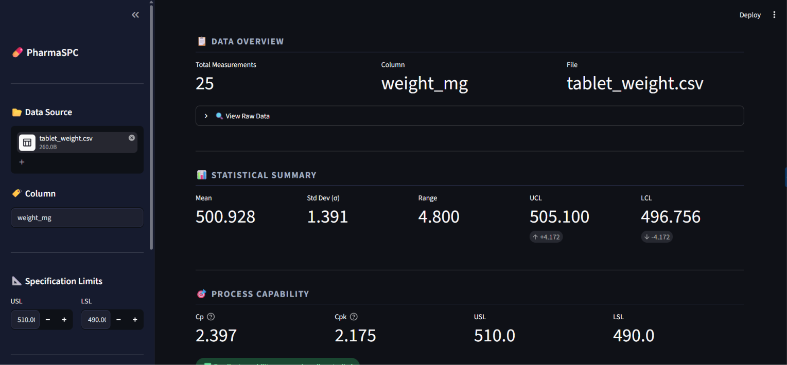
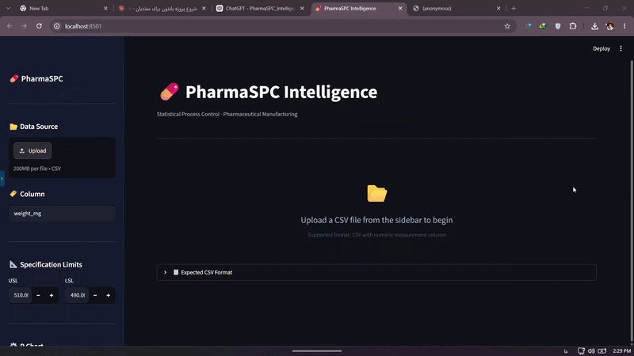
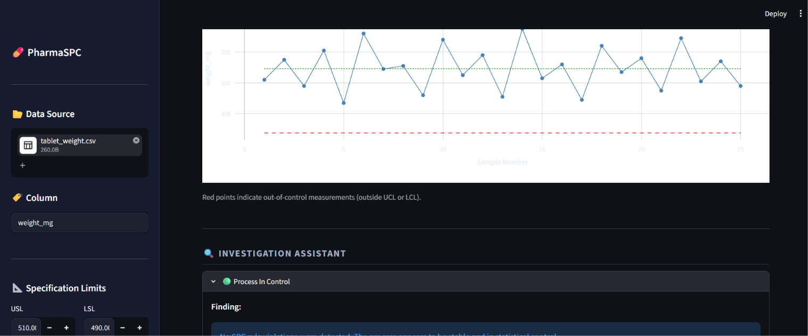
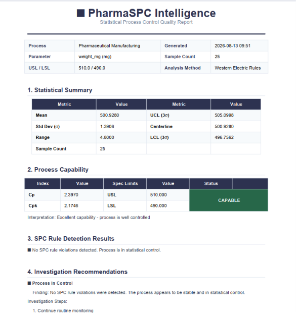

# 💊 PharmaSPC Intelligence

> Statistical Process Control (SPC) monitoring dashboard for pharmaceutical manufacturing.  
> Built with Python · Streamlit · Plotly · Pandas · Pytest

---

## The Problem

Quality engineers in pharmaceutical manufacturing spend hours manually analyzing production data in Excel.

The result:
- Process problems are detected **after** defective products are made
- Trends and shifts go unnoticed until it's too late
- Decisions depend on individual experience, not data

PharmaSPC Intelligence solves this by providing **automatic, real-time SPC analysis** through a clean web dashboard.

---

## Dashboard Preview

| Section | Description |
|---|---|
| 📋 Data Overview | Upload CSV, preview measurements |
| 📊 Statistical Summary | Mean, Std Dev, Range, UCL, LCL |
| 🎯 Process Capability | Cp, Cpk with plain-language interpretation |
| 📈 SPC Charts | X-Bar, R Chart, Histogram |
| 🔍 Investigation Assistant | Detected issues + probable causes + action steps |
---
## Complete Review

---


## Features

### Statistical Analysis
- Mean, median, standard deviation, range
- Control limits (UCL, LCL) using 3-sigma method
- Process capability indices: **Cp** and **Cpk**
- Plain-language interpretation of capability results

### SPC Charts (Interactive — Plotly)
- **X-Bar Chart** — monitors process mean over time, highlights out-of-control points in red
- **R Chart** — monitors process variation using subgroup ranges and D3/D4 constants
- **Histogram** — shows measurement distribution with specification limit overlays

### Automatic Rule Detection (Western Electric Rules)
- **Rule 1** — One point beyond 3-sigma control limits
- **Rule 2** — Seven consecutive points trending up or down
- **Rule 3** — Eight consecutive points on one side of the centerline

### Investigation Assistant
When a rule fires, the system automatically generates:
- Plain-language description of what was detected
- List of probable root causes
- Ordered investigation steps

> No external AI API required. The assistant is fully rule-based and deterministic — zero cost to run.

### Data Management
- CSV file upload with automatic validation
- Missing value detection and removal
- Outlier flagging using IQR method
- Clear error messages for invalid data

---

## Project Structure

```
PharmaSPC_Intelligence/
├── app.py                  # Streamlit dashboard entry point
├── src/
│   ├── data/
│   │   └── data_loader.py  # CSV reading and validation
│   ├── stats/
│   │   └── basic_stats.py  # Mean, std dev, Cp, Cpk, control limits
│   ├── charts/
│   │   └── spc_charts.py   # X-Bar, R Chart, Histogram (Plotly)
│   └── rules/
│       ├── rule_engine.py  # Western Electric rule detection
│       └── assistant.py    # Rule-based recommendation engine
├── tests/
│   ├── test_basic_stats.py     # 18 tests
│   ├── test_data_loader.py     # 7 tests
│   ├── test_spc_charts.py      # 9 tests
│   └── test_rule_engine.py     # 12 tests
├── data/
│   └── samples/
│       └── tablet_weight.csv   # Sample dataset (tablet weight, mg)
└── requirements.txt
```

---

## Technology Stack

| Layer | Technology |
|---|---|
| Language | Python 3.10+ |
| Dashboard | Streamlit |
| Charts | Plotly |
| Data Processing | Pandas, NumPy |
| Statistics | SciPy |
| Testing | Pytest |
| Version Control | Git / GitHub |

---

## Getting Started

### 1. Clone the repository
```bash
git clone https://github.com/hadiii1i/PharmaSPC_Intelligence.git
cd PharmaSPC_Intelligence
```

### 2. Create and activate virtual environment
```bash
python -m venv venv

# Windows
venv\Scripts\activate

# macOS / Linux
source venv/bin/activate
```

### 3. Install dependencies
```bash
pip install -r requirements.txt
```

### 4. Run the dashboard
```bash
streamlit run app.py
```

Open `http://localhost:8501` in your browser.

### 5. Run tests
```bash
pytest tests/ -v
```

Expected output: **46 tests passing**

---

## Sample Data

A sample CSV file is included at `data/samples/tablet_weight.csv`.

Format:
```
sample_id,weight_mg
1,500.2
2,501.5
3,499.8
...
```

Upload it from the sidebar to explore all dashboard features.
## Sample PDF Report

---

## Pharmaceutical Use Cases

The system supports any numeric measurement parameter, including:

**Tablet Manufacturing** — Weight, Hardness, Thickness, Dissolution  
**Packaging** — Fill volume, Seal strength  
**Laboratory** — Assay results, pH, Moisture content

---

## Development Roadmap

| Phase | Status | Description |
|---|---|---|
| Phase 1 | ✅ Complete | CSV upload, statistical analysis, SPC charts, rule detection, investigation assistant |
| Phase 2 | ✅ Complete | PDF report generation |
| Phase 3 | 🔲 Planned | SQLite database, historical trend analysis |
| Phase 4 | 🔲 Planned | User management, CAPA integration |

---

## Testing

```bash
# Run all tests
pytest tests/ -v

# Run specific module
pytest tests/test_basic_stats.py -v
pytest tests/test_rule_engine.py -v
```

| Module | Tests |
|---|---|
| basic_stats.py | 18 |
| data_loader.py | 7 |
| spc_charts.py | 9 |
| rule_engine.py | 12 |
| **Total** | **46** |

---

## Author

**Hadi Yabari**  
GitHub: [@hadiii1i](https://github.com/hadiii1i)

Linkdin: [@hadiii1i](https://www.linkedin.com/in/hadi-yabari/)
---

## License

This project is open source and available under the [MIT License](LICENSE).
